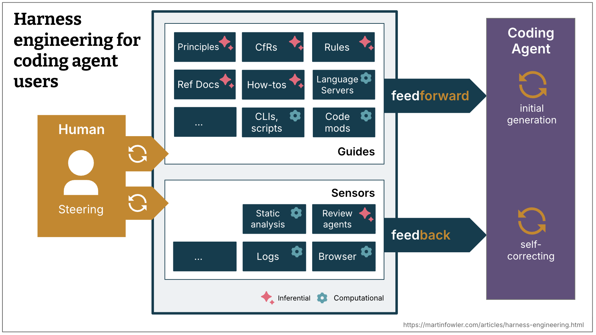
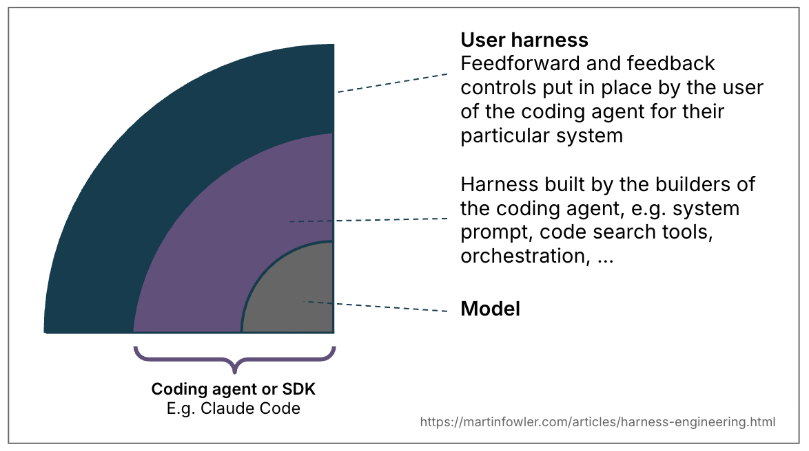

<!-- _paginate: skip -->
<!-- _class: lead -->

# nda-skills

## From a chat prompt to a shared coding-agent harness

**A practical introduction for NDA software developers**

<!--
Open with the key idea: the model does not see our organization, codebase,
standards, or delivery expectations unless we make those things available.
nda-skills makes selected parts of that context reusable.
-->

---

# Outline

1. Why context management is the real problem
2. From prompts to harnesses
3. What nda-skills provides today
4. How the workflows support quality
5. How to start using and improving them

---

# The evolution: prompt → context → harness

| Stage               | What we give the agent                                | Limitation                                  |
| ------------------- | ----------------------------------------------------- | ------------------------------------------- |
| **Chat prompt**     | A request and a few constraints                       | Important details disappear or are repeated |
| **Managed context** | Repository docs, conventions, tools, and examples     | Context is still easy to omit or contradict |
| **CLI harness**     | Reusable guidance plus checks in the development loop | Requires deliberate team maintenance        |

> At its core, agent-assisted development is about managing the **context and prompt** sent to the model.

<!--
Do not imply that chat is bad. A prompt is still useful; the issue is trying
to carry durable team knowledge and quality controls entirely in each chat.
-->

---

# Context is more than the prompt box

When a coding agent works in a repository, its effective context includes:

- the task and acceptance criteria
- repository instructions and architecture
- language and framework conventions
- available tools, tests, and quality gates
- feedback from commands it has just run

**Good context is relevant, current, discoverable, and actionable.**

<!--
Tie this to daily experience: humans gain this context gradually. Agents need
the important pieces surfaced explicitly and at the right time.
-->

---

<!-- _class: image-slide -->

# A harness makes the context operational



**Guides steer the first attempt; sensors give the agent a chance to self-correct.**

<!--
Use the visual to describe the loop from human steering to guides and sensors.
Call out that the first visual category (guides) is feedforward, while the
second (sensors) creates feedback after the agent has acted.
-->

---

# Computational vs. inferential controls

| Control type | Strength | Good examples |
| --- | --- | --- |
| **Computational** | Fast, deterministic, repeatable | Compiler, tests, linters, coverage, structural rules |
| **Inferential** | Semantic judgment and richer interpretation | Focused AI review, design review, periodic drift analysis |

Use fast computational controls during the coding loop. Use inferential controls where the question needs judgment—and treat their output as input to review, not proof.

<!--
The important contrast is not "old tools versus AI." Both are harness
controls. Computational feedback is cheap enough to shift left; inferential
feedback helps with meaning and trade-offs, but is slower and probabilistic.
-->

---

# Skills guide the agent; hooks guard transitions

| | Skills | Hooks |
| --- | --- | --- |
| **Primary role** | Load focused context and coordinate a workflow | Run a deterministic command at a lifecycle event |
| **Best for** | Standards, TDD, debugging, review, and task-specific judgment | Fast checks before or after an action |
| **Current NDA example** | Explain when and how to scan and remediate credentials | Trusted `PreToolUse` gate before Codex runs `git commit` or `git push` |

`secrets-credential-scanning` is deliberately **both**: the skill supplies the workflow and remediation context; the hook provides a repeatable computational guardrail.

<!--
Do not present hooks as a replacement for skills. A hook is the right shape
for deterministic controls at a known event; a skill is the right shape for
reasoning about the task, interpreting feedback, and deciding what to do next.
-->

---

<!-- _class: image-slide -->

# Where nda-skills sits



**Codex provides the inner harness. We add an outer harness tailored to NDA's development environment.**

<!--
The article labels the outer layer “user harness.” In this talk, that is the
team-level outer harness we create for NDA. Emphasize that nda-skills augments
Codex; it does not replace the agent's own system instructions, tooling,
retrieval, or orchestration.
-->

---

# obra/superpowers: a process framework

[`obra/superpowers`](https://github.com/obra/superpowers) is a composable-skill framework and development methodology for coding agents.

It provides general, reusable process skills such as:

- **Shape the work:** brainstorming, design, planning, and worktree setup
- **Build safely:** test-driven development, systematic debugging, and task execution
- **Close with evidence:** code review, verification, and branch completion

Its skills make disciplined practices available at the point a coding task needs them.

---

# nda-skills: the NDA specialization layer

`nda-skills` builds on that pattern with the context that generic process skills cannot know:

| Today | Growing from development evidence |
| --- | --- |
| Common skills: pair-programming TDD, CodeCommit PR work, credential scanning, and a pre-Git credential hook | **Angular** and **Python** skills *(not yet shipped)* |
| Language-specific skills: **Java/Spring Boot** standards, harness, and verification | Additional **sensors** and feedback controls as we learn where agents need more guidance |

```text
Task → Codex matches relevant installed skills
     → Superpowers process guidance + nda-skills specialization
     → focused instructions enter the agent's working context
```

**The agent uses installed matching skills during a task; it does not fetch their instructions from the network at runtime.**

<!--
Make the boundary clear: Java/Spring Boot is the current language-specific
coverage. The roadmap is intentionally evidence-driven: add Angular, Python,
and further sensors as team experience reveals repeatable needs.
-->

---

# nda-skills is a team-maintained outer harness

**One repository, many consumers.** `nda-skills` is a Codex plugin marketplace containing shared skill instructions.

- Skills are selected from their descriptions when the task matches.
- They add focused context at the time it is useful—rather than putting every rule in every prompt.
- They coordinate work with existing engineering controls; they do not replace them.

**Current focus:** shared workflow and security controls, plus Java/Spring guidance and verification.

---

# Inside the nda-skills repository

```text
hooks/
├── hooks.json           Codex lifecycle-event registration
└── scripts/             Deterministic hook commands
skills/
├── common/             Cross-stack workflows and credential scanning
├── java-springboot/    Current Java and Spring Boot guidance
├── angular-electron/   Planned—not yet shipped—Angular and Electron guidance
└── python/             Planned—not yet shipped—Python guidance
```

- A stack folder groups related skills; each skill is a folder containing a `SKILL.md` with a trigger description and instructions.
- `hooks/` contains deterministic lifecycle controls; it is separate from the context and workflow instructions under `skills/`.
- `common/` holds reusable workflows. Stack folders hold conventions, harnesses, and verification relevant to that ecosystem.
- Grouping keeps the repository maintainable; **the skill description determines when Codex applies it.**

<!--
Use the tree as a map: common is cross-stack; Java/Spring Boot exists today;
Angular/Electron and Python are the planned next language areas. The folders
organize the skills, while each skill's description controls its activation.
-->

---

# Install once; upgrade when the harness improves

```zsh
codex plugin marketplace add https://github.com/NDAR/nda-skills.git --ref main
codex plugin add nda-skills@nda-skills
```

Start a new Codex session, then check installation:

```zsh
codex plugin list
```

Pick up published improvements with:

```zsh
codex plugin marketplace upgrade
```

When an upgrade includes hooks, open `/hooks`, review the `nda-skills` definition, and **trust** it. The credential hook also requires `gitleaks` on your local PATH.

<!--
The marketplace lets the team ship refinements once and lets developers pull
them with a single upgrade command. This is the distribution mechanism, not
a replacement for each repository's own rules.
-->

---

# Skills in a Java/Spring delivery workflow

| Stage | Skills and controls that enter here |
| --- | --- |
| **Start the change** | `java-spring-harness` coordinates; it invokes `java-spring-coding-standards` first. Repository rules remain authoritative. |
| **Build one small behavior** | `pair-programming-tdd` drives RED → GREEN → refactor. Applicable Superpowers skills support TDD, debugging, and code review. |
| **Iterate with feedback** | Run the repository's fast, relevant checks while the change is small. |
| **Prepare completion** | Stage changes with `git add -A`; `secrets-credential-scanning` directs a staged gitleaks scan. A trusted `PreToolUse` hook independently blocks Codex-issued `git commit` or `git push` unless its scan passes. |
| **Verify and report** | `java-spring-verification`: Maven, at least 80% JaCoCo line coverage, and optional SonarQube Quality Gate checks. |

**The harness supplies the right context and feedback at each stage—not every instruction at once.**

<!--
For Java/Spring work, java-spring-harness is the coordinator. It requires the
coding-standards skill first, pair-programming TDD during implementation, a
staged secrets scan before verification, and fresh verification evidence at
completion. The trusted hook adds a final computational gate before Codex
commits or pushes; it does not replace CI or PR-range scanning. gitleaks must
already be installed locally.
-->

---

# If the change becomes a CodeCommit PR

`codecommit-pr-merge` guides the merge workflow after implementation is ready:

1. **Find and inspect the right PR** — confirm repository, source/destination branches, commits, and approvals.
2. **Review the diff** — inspect the change and its affected files.
3. **Scan the PR range** — `secrets-credential-scanning` checks `destinationCommit..sourceCommit`; a non-allowlisted finding blocks the merge. This is separate from the local pre-Git hook.
4. **Verify merge readiness** — run the project's appropriate verification command and confirm approval rules are satisfied.
5. **Merge safely** — squash merge using the current source commit.
6. **Verify, then clean up** — confirm the PR merged; delete **only** the verified source branch.

**The destination branch is never deleted.**

<!--
This is an optional workflow. It is only relevant when the user asks to
review, merge, or clean up an AWS CodeCommit pull request. Emphasize the
sequence: scan before merge, and branch deletion only after successful merge
verification.
-->

[Maintainability sensors for coding agents](https://martinfowler.com/articles/sensors-for-coding-agents.html)

---

# The developer loop we are building

```text
Developer goal
    ↓
Relevant skills and trusted hooks supply focused context and guardrails
    ↓
Agent changes code in a small, inspectable slice
    ↓
Tests / static analysis / credential scanning / coverage provide feedback
    ↓
Agent corrects; developer reviews the important judgment calls
    ↓
Team improves a skill, hook, or repository control when a pattern repeats
```

This is **harness engineering as an ongoing practice**, not a one-time prompt template.

---

# What nda-skills does _not_ automate away

- Clear product intent and acceptance criteria
- Trade-offs between simplicity, delivery speed, and technical debt
- Security, privacy, and operational accountability
- Human code review and ownership

> A good harness directs human attention to the decisions that matter most; it does not eliminate it.

---

# Start small; improve from evidence

1. Install the plugin and try a relevant workflow on a real task.
2. Notice repeated agent or review friction.
3. Decide whether the missing control is a **guide**, a **sensor**, or both.
4. Improve the skill, hook, or repository control; publish the change through the marketplace.
5. Upgrade and share what changed.

**A useful skill turns one team's learned context into a reusable advantage for everyone.**

Bring back the rough edges: **Where did the agent lack context? What feedback arrived too late? What should become shared team knowledge?**

---

# Sources and further reading

- Birgitta Böckeler, [Harness engineering for coding agent users](https://martinfowler.com/articles/harness-engineering.html), Martin Fowler, 2 April 2026.
- Birgitta Böckeler, [Maintainability sensors for coding agents](https://martinfowler.com/articles/sensors-for-coding-agents.html), Martin Fowler, 27 May 2026.
- [`obra/superpowers`](https://github.com/obra/superpowers) — the composable skill framework and development methodology that nda-skills builds upon.
- [Codex hooks documentation](https://developers.openai.com/codex/hooks) — lifecycle events, trust review, and plugin hook configuration.
- [gitleaks](https://github.com/gitleaks/gitleaks) — credential scanner used by the `secrets-credential-scanning` skill.
- Embedded diagrams: *Harness overview* and *Harness bounded contexts*, reproduced from the harness-engineering article above; attribution is retained in each image.
- [Marpit directives documentation](https://marpit.marp.app/directives) — YAML front matter, pagination, footers, and CSS styling.
- This repository: [`README.md`](../README.md) and the current [`skills/`](../skills/) directory.

<!--
The deck paraphrases the Fowler articles. Their central ideas used here are
guides/sensors, computational/inferential controls, and shifting fast
feedback left. The repo files are the source of truth for nda-skills scope
and commands.
-->
